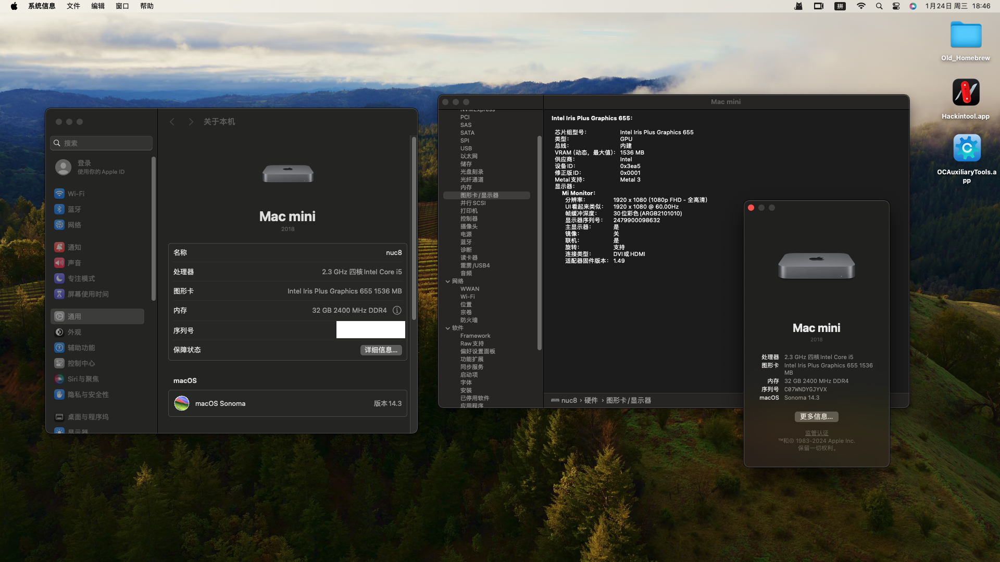

# OpenCore for intel nuc8i5beh/nuc8i5bek （Broadcom）

## 简介

完美 😀。

|       Key       |    Value    |
| :--------------: | :---------: |
| OpenCore version |    0.9.7    |
|  MacOS version  | Sonama 14.3 |

## Bios 设置

- Devices -> USB -> Port Device Charging Mode: off
- Devices -> USB -> USB Legacy -> Disabled
- Security -> Thunderbolt Security Level: Legacy Mode
- Power -> Wake on LAN from S4/S5: Stay Off
- Boot -> Boot Configuration -> Network Boot: Disable
- Boot -> Secure Boot -> Disable
- Devices -> Video -> only HDMI(not auto, secondary not Thunderbolt) [https://github.com/sarkrui/NUC8i7BEH-Hackintosh-Build/issues/14#issuecomment-792000732](https://github.com/sarkrui/NUC8i7BEH-Hackintosh-Build/issues/14#issuecomment-792000732)

## 安装说明

- **我的是占用了读卡器的硬改版本里面有博通网卡驱动，如果你是英特尔网卡需要更换为英特尔网卡驱动**
- 记得换三码，里面没有自带的
- 不要换机型，否则 usb 接口无法使用，需要替换 USBPorts.kext 内 plist 的机型值，你会写代码的话很简单打开改下两个地方就行
- 已经用来写了好几年的代码，没啥问题。能开发，这个项目也是在 mac 下系统下传上来的
- github 星星最多的 efi 我也用过，用起来比现在配置的卡。不知道啥问题，如果我的 efi 有问题你们也可以看看：[https://github.com/zearp/Nucintosh](https://github.com/zearp/Nucintosh)
- type C + hdmi 双屏启动卡死，进bios将 video 输出选项调整为HDMI和NONE
- (dual monitor stuck on startup, set BIOS Video to HDMI as primary, none as secondary)

## 补丁

- 安装完sonama后wifi无法使用，需要使用 OpenCore-Patcher 进行修复 [https://www.youtube.com/watch?reload=9&amp;v=tJUyRWGgRuU](参考)

## 硬件

|   Key   |                                     Value                                     | Other    |
| :------: | :---------------------------------------------------------------------------: | -------- |
|   CPU   |         Intel® Core™ i5-8259U Processor (6M Cache, up to 3.80 GHz)         | 4c8h     |
|   显卡   |               Intel CoffeeLake-U GT3e [Iris Plus Graphics 655]               |          |
|   内存   |                           金士顿骇条 16G + 酷兽 16G                           | 32GB     |
| 无线网卡 |          Broadcom BCM43xx 1.0 (7.77.ß.1 AirPortDriverBrcmNIC-1766)          | 94360cs2 |
| 有线网卡 |                    Intel(R) Ethernet Connection (6) I219-V                    |          |
|   声卡   | Realtek ALC233 @ Intel Cannon Point-LP PCH - cAVS (Audio, Voice, Speech) [D0] |          |
|   硬盘   |                            WD Blue SN720 500G SSD                            |          |
|   接口   |              USB-C (DP1.2) X1 ``HDMI 2.0a X1``RJ45 网口 X1``...              |          |

## 正常工作

- CPU 正常睿频
- 博通网卡 - 隔空投送
- 声卡
- 睡眠
- 核显正常驱动，支持缩放/夜览

## sonama截图

## 部分系统截图 [https://github.com/SunSeekerX/intel-nuc8-i5beh-hackintosh-opencore-efi](fork仓库)

程序坞

| Describe | screenshot                                                                   |
| -------- | ---------------------------------------------------------------------------- |
| Nvme     | `` |
| USB      | ``  |
| 以太网   | ``  |
| 内存     | ``  |
| 显卡     | ``  |
| 电源     | ``  |
| 蓝牙     | ``  |
| 音频     | ``  |
| WIFI     | ``  |

## 部分 efi 截图

| Describe | screenshot                                                                                                  |
| :------: | ----------------------------------------------------------------------------------------------------------- |
|   ACPI   | `` |
|    Dp    | `` |
|  Kernel  | `` |

## 更新日志

### 2024-05-26

* 更新双屏启动卡死解决方案

### 2024-01-23

- 更新到 oc 0.9.7
- 更新驱动到最新版

### 2023-04-08

- 更新到 oc 0.9.1
- 变更版本为官方的 oc，mod oc用不出来啥区别
- 驱动升级到最新版

### 2023-04-03

- 更新到 oc 0.9.0

### 2023-03-10

- 尝试使用 mod 版本的 oc

### 2023-02-24

- 增加了 CFGLock 查看工具，需要按住空格显示辅助工具
- 默认隐藏辅助工具，按住空格显示

## 参考

- [[OpenCore] NUC8 最新 OC EFI 持续更新（已更新至 0.8.7+13.1）](https://bbs.pcbeta.com/viewthread-1935097-1-1.html) by yippeeghost
